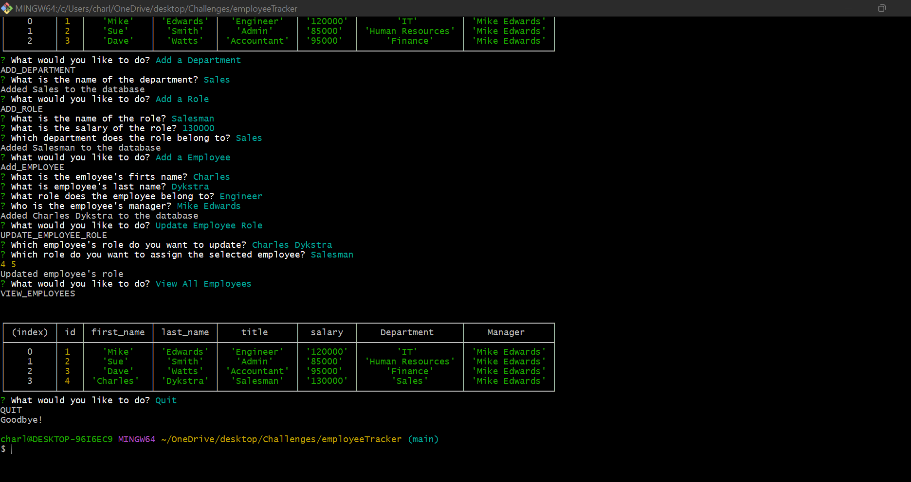

<!DOCTYPE md>
# Employee Tracker

## Description:
Node application to track and update employees.

## Technologies:
Node js, javascript, SQL

## Links:

link to github: https://github.com/cdthe1nonly1/employeeTracker.git

link to Employee Tracker webpage: There is no application link for this as it is done in node.

Video walkthrough Link: https://drive.google.com/file/d/1qdH3B-1OsXEysmw3Rmpek68euhNmuolt/view

## Images:

Image Link 

Video Presentation: /assets/EmployeeTrackerVideo.webm

Video Link: 

## Usage:

This application is used to manage and track employees. It allows you to view by department, employee and roles.  It will also allow you to add a department, add a role and add an employee.  Finally it will allow you to update employee roles

## Licences:

None